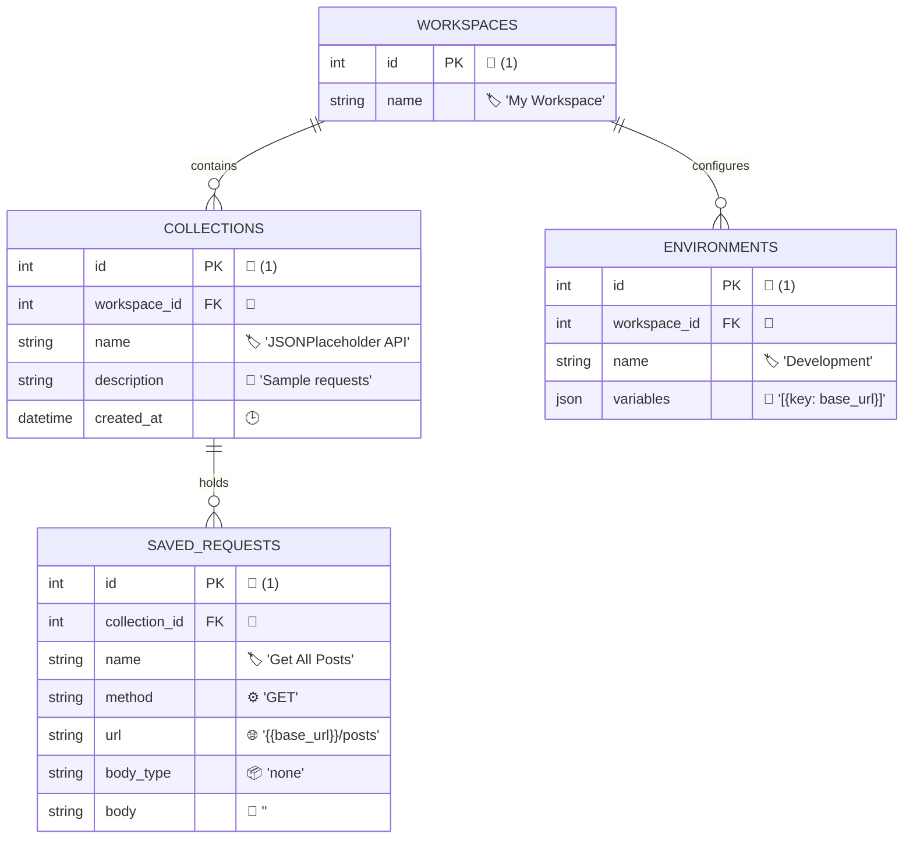

# Postman API Clone

A fully functional API testing and development environment built to replicate the core features of Postman. This application allows developers to build, test, manage, and execute HTTP requests seamlessly from a unified, modern interface. 

## 🚀 Features

- **Advanced Request Builder**: Support for GET, POST, PUT, DELETE, PATCH, and more.
- **Dynamic Environments**: Manage global variables (e.g., `{{base_url}}`) to seamlessly switch between local, staging, and production servers.
- **Intelligent Response Viewer**: Automatic formatting and syntax highlighting for JSON, XML, HTML, and Text. Includes detailed network metrics (Status Code, Time, Size).
- **Workspace & Collections**: Group your API requests logically into Collections and Workspaces.
- **History Tracking**: Automatically logs every request you send, allowing you to replay past requests instantly.
- **Advanced Features (Mock Servers & Monitors)**: Setup mock endpoints and schedule API monitoring.

## 🛠️ Architecture Overview

This project is built using a modern decoupled architecture:

### Frontend (Client)
- **Framework**: [Next.js 14](https://nextjs.org/) (App Router)
- **Language**: TypeScript
- **Styling**: Tailwind CSS (with highly customized, dark-mode focused Postman-like aesthetics)
- **State Management**: React Hooks (`useState`, `useEffect`, `useRef`) and Zustand for global state.

### Backend (Server / Proxy)
- **Framework**: [FastAPI](https://fastapi.tiangolo.com/) (Python)
- **Database**: SQLite (managed via SQLAlchemy ORM)
- **Role**: Acts as an intermediary proxy. It circumvents CORS restrictions that typically block browser-based API testing tools, securely forwards requests to target APIs using `httpx`, logs the history into the database, and returns the response to the frontend.

## 💾 Database Schema

The database architecture is designed using a strictly normalized relational model to ensure data integrity and scalable organization. At the highest level, **Workspaces** act as the primary tenant or root container. Everything else branches out from a Workspace. 

Within a Workspace, API routes are logically grouped into **Collections** (like folders), and these Collections contain the actual **Saved Requests** (the endpoints being tested). In parallel, a Workspace can have multiple **Environments** (such as 'Development', 'Staging', or 'Production'), each storing a unique set of **Environment Variables** securely. When a request is sent, the proxy automatically checks the selected Environment, injects the necessary variables into the URL/Headers, executes the request, and logs the result permanently in the **History** table for auditing.

Below is the core SQLite schema with dummy data representing this architecture:



## 📡 API Overview

The FastAPI backend exposes the following RESTful endpoints:

### Proxy
- `ALL /api/proxy/send`: The core proxy endpoint. Accepts custom headers (`x-postman-target-url`, `x-postman-target-method`) and securely forwards the HTTP request to the target destination.
- `GET /api/proxy/history`: Retrieves the chronological history of all executed requests.
- `DELETE /api/proxy/history/{id}`: Deletes a specific history record.

### Collections & Workspaces
- `GET /api/collections/workspaces`: Fetch all workspaces.
- `GET /api/collections/`: Fetch all collections within a workspace.
- `POST /api/collections/`: Create a new collection.

### Requests
- `GET /api/requests/collection/{collection_id}`: Fetch all saved requests in a collection.
- `POST /api/requests/`: Save a new API request.

### Environments
- `GET /api/environments/`: Retrieve all environments and their associated variables.
- `POST /api/environments/`: Create a new environment.
- `POST /api/environments/{env_id}/variables`: Add variables to an environment.

## 💻 Setup Instructions

Follow these steps to run the application locally on your machine.

### Prerequisites
- [Node.js](https://nodejs.org/) (v18+)
- [Python](https://www.python.org/) (3.9+)

### 1. Start the Backend (FastAPI)
Open a terminal and navigate to the `backend` directory:
```bash
cd backend

# Create a virtual environment (optional but recommended)
python -m venv venv

# Activate the virtual environment
# On Windows:
venv\Scripts\activate
# On macOS/Linux:
source venv/bin/activate

# Install dependencies
pip install -r requirements.txt

# Run the server
uvicorn app.main:app --reload --port 8000
```
The backend will start on `http://localhost:8000`. The SQLite database (`postman_clone.db`) will be created automatically.

### 2. Start the Frontend (Next.js)
Open a new terminal window and navigate to the `frontend` directory:
```bash
cd frontend

# Install dependencies
npm install

# Start the development server
npm run dev
```
The frontend will start on `http://localhost:3000`.

### 3. Usage
1. Open your browser and go to `http://localhost:3000`.
2. Enter a URL (e.g., `https://jsonplaceholder.typicode.com/todos/1`), select `GET`, and click **Send**.
3. Explore Collections, History, and Environments from the sidebar!

---
*Disclaimer: This project is an assignment/clone built for educational purposes and is not affiliated with Postman, Inc.*
